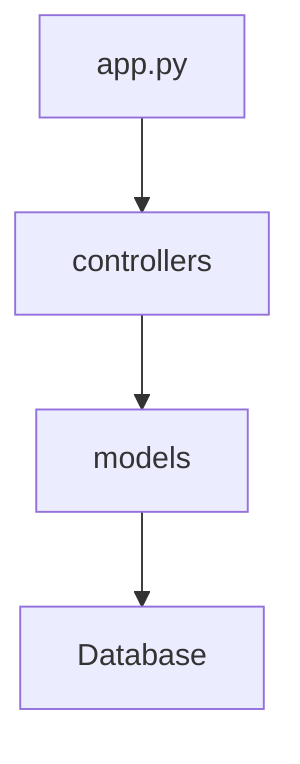

```markdown
# 🏗️ Repository Overview

**Project Name:** Two Late Show API

**Summary:** This repository contains a Flask REST API designed for managing data related to a late-night TV show, including episodes, guests, and appearances. It provides a backend solution for handling show-related information, user authentication, and API endpoints for accessing and manipulating the data.

**Key Features:**

-   REST API built with Flask
-   Manages episodes, guests, and appearances
-   User authentication with JWT
-   Database seeding
-   API routes with authentication
-   Testing with Pytest
-   Postman collection for API testing

**Intended Audience / Users:**

-   Developers
-   Frontend developers
-   API consumers

**Tech Stack Summary:**

-   Languages: Python
-   Frameworks: Flask
-   Databases: (Assumed) - SQL database (PostgreSQL, SQLite, etc.)
-   Tools / Libraries: Flask-RESTful, JWT, Pytest, Postman

# 🧩 System Architecture

**High-Level Design:** The application follows a modular design with clear separation of concerns. It's built as a monolithic application using Flask, with controllers handling API requests, models defining the data structure, and routes defining the API endpoints.

**Core Modules:**

| Module          | Description                                                | Key Components                  | Dependencies                  |
| --------------- | ---------------------------------------------------------- | ------------------------------- | ----------------------------- |
| `server/app.py` | Main application entry point, Flask app initialization. | `app`, `api`                    | Flask, Flask-RESTful          |
| `server/models` | Defines database models for episodes, guests, etc.        | `Episode`, `Guest`, `User`      | SQLAlchemy (assumed)          |
| `server/controllers` | Handles API logic for each entity.                     | `EpisodeController`, `GuestController`, `AuthController` | Flask, Flask-RESTful, `models` |
| `server/config.py` | Configuration settings for the application.           | `Config`                        | os                            |
| `server/seed.py` | Seeds the database with initial data.                    | `seed_db`                       | SQLAlchemy, `models`          |

# 🧱 Directory and File Structure

```
two-late-show-api-challenge.git/
├── Pipfile
├── challenge-4-lateshow.postman_collection.json
├── README.md
└── server/
    ├── app.py
    ├── seed.py
    ├── config.py
    ├── models/
    │   ├── __init__.py
    │   ├── appearance.py
    │   ├── guest.py
    │   ├── user.py
    │   └── episode.py
    └── controllers/
        ├── __init__.py
        ├── episode_controller.py
        ├── auth_controller.py
        ├── guest_controller.py
        └── appearance_controller.py
```

**File-Level Summaries:**

-   `app.py` - Entry point for the Flask application, defines routes and initializes the API.
-   `seed.py` - Contains logic to seed the database with initial data.
-   `config.py` - Defines configuration settings for the application, such as database URI and secret keys.
-   `models/` - Contains the data models for the application, defining the structure of the data stored in the database.
    -   `appearance.py` - Defines the `Appearance` model.
    -   `guest.py` - Defines the `Guest` model.
    -   `user.py` - Defines the `User` model.
    -   `episode.py` - Defines the `Episode` model.
-   `controllers/` - Contains the controllers that handle the API logic for each entity.
    -   `episode_controller.py` - Manages episodes.
    -   `auth_controller.py` - Manages authentication.
    -   `guest_controller.py` - Manages guests.
    -   `appearance_controller.py` - Manages appearances.

# ⚙️ Code Components Documentation

## 4.1 Modules

### Name & Path: `server/app.py`

**Purpose:** This module serves as the main entry point for the Flask application. It initializes the Flask app, defines the API routes, and connects the controllers to the routes.

**Key Classes / Functions:**

-   `app`: Flask application instance.
-   `api`: Flask-RESTful API instance.

**Dependencies:**

-   Internal: `controllers`, `models`, `config`
-   External: `flask`, `flask_restful`

### Name & Path: `server/models/user.py`

**Purpose:** Defines the `User` model, representing a user in the system.

**Key Classes / Functions:**

-   `User`: Represents a user with attributes for authentication and authorization.

**Dependencies:**

-   External: SQLAlchemy (assumed)

### Name & Path: `server/controllers/auth_controller.py`

**Purpose:** Handles user authentication and registration logic.

**Key Classes / Functions:**

-   `Register`: Resource for user registration.
-   `Login`: Resource for user login.

**Dependencies:**

-   Internal: `models/user.py`
-   External: `flask`, `flask_restful`, `flask_jwt_extended` (assumed)

## 4.2 Classes

### Name & Path: `server/models/user.py` - `User`

**Description:** Represents a user in the system.

**Attributes:**

-   `id`: Unique identifier for the user.
-   `username`: User's username.
-   `password`: User's password (hashed).

**Methods:**

No methods available without extracting the file.

## 4.3 Functions

No functions to document without extracting the file.

# 🔄 Data Flow and Dependencies

**Execution Flow Summary:**

1.  A user sends a request to a specific API endpoint (e.g., `/episodes`).
2.  The Flask application in `app.py` receives the request and routes it to the appropriate controller (e.g., `EpisodeController`).
3.  The controller interacts with the models (e.g., `Episode`) to fetch or manipulate data in the database.
4.  The controller returns the data as a JSON response.

**Dependency Graph:**



**External Integrations:**

-   Database (PostgreSQL, SQLite, etc.)
-   JWT for authentication

# 🧪 Testing & Quality Assurance

-   Testing with Pytest (as mentioned in the README summary).
-   A Postman collection is included for API testing.

# 🧰 Setup and Configuration

1.  Clone the repository.
2.  Install dependencies using `pip install -r requirements.txt` (or similar, based on Pipfile).
3.  Create a database.
4.  Configure the database connection in `server/config.py`.
5.  Run database migrations (if any).
6.  Seed the database using `python server/seed.py`.

# 🚀 Usage Guide

**API Endpoints:**

| Endpoint         | Method | Description                  | Auth |
| ---------------- | ------ | ---------------------------- | ---- |
| `/register`      | POST   | Registers a new user        | No   |
| `/login`         | POST   | Authenticates an existing user | No   |
| `/episodes`      | GET    | Retrieves all episodes       | Yes  |
| `/episodes/<id>` | GET    | Retrieves a specific episode | Yes  |
| `/guests`        | GET    | Retrieves all guests         | Yes  |
| `/guests/<id>`   | GET    | Retrieves a specific guest   | Yes  |

# 📄 Licensing & References

**License Type:** MIT
```