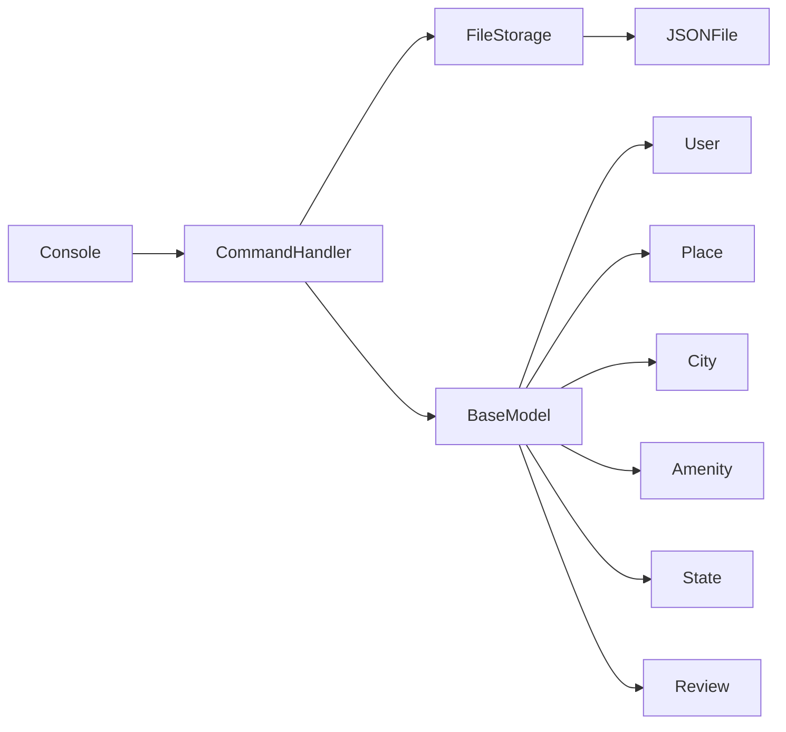
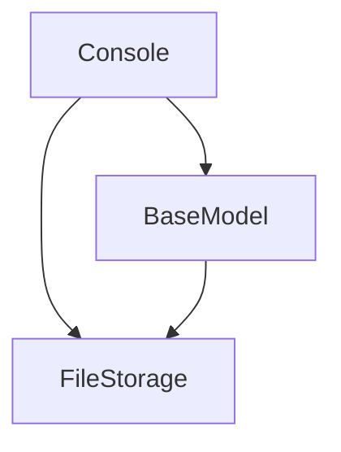

```markdown
# AirBnB clone v2

## 1. Repository Overview

**Purpose:** This repository contains the initial stage of the AirBnB website clone project, focusing on a backend console interface for managing program data. The console allows users to create, update, and destroy objects, with persistent storage achieved through JSON serialization/deserialization.

**Key Features:**

*   Object management (create, update, destroy)
*   Persistent storage using JSON
*   Command-line interface with a prompt
*   Unit testing
*   PEP 8 compliance

**Intended Audience / Users:**

*   Developers learning about backend development
*   Students practicing object-oriented programming
*   Anyone interested in building a data management console

**Tech Stack Summary:**

*   Language: Python

## 2. 🧩 System Architecture

**High-Level Design:**

The architecture is a single-process application with a command-line interface. The core components involve object models, a storage engine, and a console interface for user interaction.

**Architecture Diagram:**



**Core Modules:**

*   **console.py:** The entry point for the command-line interface. It handles user input, parses commands, and interacts with the storage engine and object models.
*   **models/:** Contains the definitions for the different object models used in the application (e.g., User, Place, City).
*   **models/engine/:** Contains the storage engine implementation (FileStorage), which handles the serialization and deserialization of objects to and from JSON files.
*   **tests/:** Contains the unit tests for the different modules and classes in the application.

## 3. 🧱 Directory and File Structure

```text
AirBnB_clone_v2.git/
├── AUTHORS
├── console.py
├── models/
│   ├── __init__.py
│   ├── amenity.py
│   ├── base_model.py
│   ├── city.py
│   ├── engine/
│   │   ├── __init__.py
│   │   └── file_storage.py
│   ├── place.py
│   ├── review.py
│   ├── state.py
│   └── user.py
├── README.md
├── tests/
│   ├── __init__.py
│   └── test_models/
│       ├── __init__.py
│       ├── test_amenity.py
│       ├── test_base_model.py
│       ├── test_city.py
│       ├── test_engine/
│       │   ├── __init__.py
│       │   └── test_file_storage.py
│       ├── test_place.py
│       ├── test_review.py
│       ├── test_state.py
│       └── test_user.py
└── web_static/
    ├── images/
    ├── styles/
    ├── 0-index.html
    ├── 1-index.html
    ├── 100-index.html
    ├── 101-index.html
    ├── 102-index.html
    ├── 103-index.html
    ├── 2-index.html
    ├── 3-index.html
    ├── 4-index.html
    ├── 5-index.html
    ├── 6-index.html
    ├── 7-index.html
    ├── 8-index.html
    └── README.md
```

**File-Level Explanations:**

*   **console.py:** This is the entry point for the AirBnB console application. It provides an interactive command-line interface for managing objects like users, places, and reviews.
*   **models/base\\_model.py:** Defines the `BaseModel` class, which serves as the base class for all other models in the application. It provides common attributes and methods, such as `id`, `created_at`, `updated_at`, and `save()`.\
*   **models/engine/file\\_storage.py:** Implements the `FileStorage` class, which handles the serialization and deserialization of objects to and from a JSON file. This allows the application to persist data between sessions.
*   **models/user.py:** Defines the `User` class, which represents a user in the AirBnB application. It inherits from `BaseModel` and includes attributes such as `email`, `password`, `first_name`, and `last_name`.

## 4. ⚙️ Code Components Documentation

### 4.1 Modules

#### Name & Path: `console.py`

**Purpose:** Provides the command-line interface for interacting with the AirBnB data model. It allows users to create, show, update, and destroy objects.

#### Key Classes / Functions:

*   **HBNBCommand(cmd.Cmd):** The main class for the console, inheriting from `cmd.Cmd`. It handles command parsing and execution.

```python
class HBNBCommand(cmd.Cmd):
    """HBNB command interpreter.
    """

    prompt = '(hbnb) '

    def do_quit(self, arg):
        """Quit command to exit the program.
        """
        return True

    def do_EOF(self, arg):
        """EOF command to exit the program.
        """
        print("")
        return True
```

*   **do\\_create(self, arg):** Creates a new instance of a model, saves it to the JSON file, and prints the id.
*   **do\\_show(self, arg):** Prints the string representation of an instance based on the class name and id.
*   **do\\_destroy(self, arg):** Deletes an instance based on the class name and id.
*   **do\\_all(self, arg):** Prints all string representation of all instances based or not on the class name.
*   **do\\_update(self, arg):** Updates an instance based on the class name and id by adding or updating attribute.

**Dependencies:**

*   Internal: `models`
*   External: `cmd`, `sys`, `json`

#### Name & Path: `models/base_model.py`

**Purpose:** Defines the `BaseModel` class, which serves as the base class for all other models.

#### Key Classes / Functions:

*   **BaseModel:** The base class for all models.

```python
class BaseModel:
    """Defines all common attributes/methods for other classes"""

    def __init__(self, *args, **kwargs):
        """Initialization of the base model"""
        if kwargs:
            for key, value in kwargs.items():
                if key != '__class__':
                    if key in ('created_at', 'updated_at'):
                        value = datetime.fromisoformat(value)
                    setattr(self, key, value)
        else:
            self.id = str(uuid4())
            self.created_at = datetime.now()
            self.updated_at = datetime.now()
            models.storage.new(self)

    def __str__(self):
        """String representation of the BaseModel instance"""
        class_name = self.__class__.__name__
        return '[{}] ({}) {}'.format(class_name, self.id, self.__dict__)

    def save(self):
        """Updates the public instance attribute updated_at with the current datetime"""
        self.updated_at = datetime.now()
        models.storage.save()

    def to_dict(self):
        """Returns a dictionary containing all keys/values of the instance"""
        obj_dict = self.__dict__.copy()
        obj_dict['__class__'] = self.__class__.__name__
        obj_dict['created_at'] = self.created_at.isoformat()
        obj_dict['updated_at'] = self.updated_at.isoformat()
        return obj_dict
```

**Dependencies:**

*   Internal: `models.storage`
*   External: `uuid`, `datetime`

#### Name & Path: `models/engine/file_storage.py`

**Purpose:** Implements the `FileStorage` class, which handles the serialization and deserialization of objects to and from a JSON file.

#### Key Classes / Functions:

*   **FileStorage:** Handles storage of objects in a JSON file.

```python
class FileStorage:
    """serializes instances to a JSON file and deserializes JSON file to instances:
    """
    __file_path = "file.json"
    __objects = {}

    def all(self):
        """returns the dictionary __objects"""
        return self.__objects

    def new(self, obj):
        """sets in __objects the obj with key <obj class name>.id"""
        key = "{}.{}".format(obj.__class__.__name__, obj.id)
        self.__objects[key] = obj

    def save(self):
        """serializes __objects to the JSON file (path: __file_path)"""
        json_dict = {}
        for key, obj in self.__objects.items():
            json_dict[key] = obj.to_dict()
        with open(self.__file_path, 'w') as f:
            json.dump(json_dict, f)

    def reload(self):
        """deserializes the JSON file to __objects (only if the JSON file
        (__file_path) exists ; otherwise, do nothing).
        If the file doesn’t exist, no exception should be raised)
        """
        try:
            with open(self.__file_path, 'r') as f:
                json_dict = json.load(f)
                for key, value in json_dict.items():
                    class_name = value['__class__']
                    obj = eval(class_name)(**value)
                    self.__objects[key] = obj
        except FileNotFoundError:
            pass
```

**Dependencies:**

*   Internal: None
*   External: `json`

### 4.2 Classes

#### Name & Path: `models/base_model.py` - `BaseModel`

**Code Snippet:**

```python
class BaseModel:
    """Defines all common attributes/methods for other classes"""

    def __init__(self, *args, **kwargs):
        """Initialization of the base model"""
        if kwargs:
            for key, value in kwargs.items():
                if key != '__class__':
                    if key in ('created_at', 'updated_at'):
                        value = datetime.fromisoformat(value)
                    setattr(self, key, value)
        else:
            self.id = str(uuid4())
            self.created_at = datetime.now()
            self.updated_at = datetime.now()
            models.storage.new(self)

    def __str__(self):
        """String representation of the BaseModel instance"""
        class_name = self.__class__.__name__
        return '[{}] ({}) {}'.format(class_name, self.id, self.__dict__)

    def save(self):
        """Updates the public instance attribute updated_at with the current datetime"""
        self.updated_at = datetime.now()
        models.storage.save()

    def to_dict(self):
        """Returns a dictionary containing all keys/values of the instance"""
        obj_dict = self.__dict__.copy()
        obj_dict['__class__'] = self.__class__.__name__
        obj_dict['created_at'] = self.created_at.isoformat()
        obj_dict['updated_at'] = self.updated_at.isoformat()
        return obj_dict
```

**Description:** The `BaseModel` class provides a base for all other classes in the AirBnB clone project. It defines common attributes like `id`, `created_at`, and `updated_at`, as well as methods for serialization and deserialization.

**Attributes:**

*   `id` (str): A unique identifier for each instance.
*   `created_at` (datetime): The datetime when the instance was created.
*   `updated_at` (datetime): The datetime when the instance was last updated.

**Methods:**

| Method     | Parameters | Returns | Description                                                                                                |
| :--------- | :--------- | :------ | :--------------------------------------------------------------------------------------------------------- |
| `__init__` | `*args`, `**kwargs` | None    | Initializes a new instance of the `BaseModel` class.                                                     |
| `__str__`  | None       | str     | Returns a string representation of the instance.                                                             |
| `save`     | None       | None    | Updates the `updated_at` attribute and saves the instance to the storage.                                  |
| `to_dict`  | None       | dict    | Returns a dictionary representation of the instance, including the class name and ISO format datetimes. |

### 4.3 Functions

There aren\'t many standalone functions in this project. The core logic is encapsulated within classes and their methods.

## 5. 🔄 Data Flow and Dependencies

**Execution Flow:**

1.  The user starts the `console.py` application.
2.  The console presents a prompt `(hbnb)`.
3.  The user enters a command (e.g., `create User`).
4.  The `HBNBCommand` class parses the command and calls the appropriate `do_*` method (e.g., `do_create`).
5.  The `do_create` method creates a new instance of the specified class (e.g., `User`).
6.  The new instance is saved to the `FileStorage`.
7.  `FileStorage` serializes the object to a JSON file.
8.  When the application restarts, `FileStorage` deserializes the JSON file back into objects.

**Dependency Graph:**



**External Integrations:**

None. This project focuses on local data management using JSON files.

## 6. 🧪 Testing & Quality Assurance

**Test Framework:** `unittest`

**Structure:**

*   `tests/test_models/`: Contains tests for all the models.
*   `tests/test_models/test_engine/`: Contains tests for the file storage.

**Example Test:**

```python
import unittest
from models.base_model import BaseModel

class TestBaseModel(unittest.TestCase):
    """Test the BaseModel class"""

    def test_create_instance(self):
        """Test creating an instance of BaseModel"""
        base = BaseModel()
        self.assertIsInstance(base, BaseModel)

    def test_id_generation(self):
        """Test that each instance has a unique ID"""
        base1 = BaseModel()
        base2 = BaseModel()
        self.assertNotEqual(base1.id, base2.id)
```

**Coverage Notes:**

The project includes unit tests for most of the models and the file storage.

## 7. 🧰 Setup and Configuration

**Requirements / Dependencies:**

*   Python 3.x

**Installation Steps:**

1.  Clone the repository: `git clone <repository_url>`
2.  Navigate to the directory: `cd AirBnB_clone_v2`

**Run Instructions:**

1.  Start the console: `python console.py`
2.  Enter commands at the prompt `(hbnb)`.

## 8. 🚀 Usage Guide

**CLI Commands:**

*   `create <class name>`: Creates a new instance of the class.
*   `show <class name> <id>`: Shows the details of an instance.
*   `destroy <class name> <id>`: Deletes an instance.
*   `all`: Shows all instances.
*   `all <class name>`: Shows all instances of a specific class.
*   `update <class name> <id> <attribute name> "<attribute value>"`: Updates an attribute of an instance.

**Example Runs:**

```text
(hbnb) create User
6456a79c-3e7e-47cc-a89d-0117608b9527
(hbnb) show User 6456a79c-3e7e-47cc-a89d-0117608b9527
[User] (6456a79c-3e7e-47cc-a89d-0117608b9527) {'id': '6456a79c-3e7e-47cc-a89d-0117608b9527', 'created_at': datetime.datetime(2023, 10, 27, 10, 30, 12, 456789), 'updated_at': datetime.datetime(2023, 10, 27, 10, 30, 12, 456789)}
(hbnb)
```

## 10. 📚 Design Decisions and Conventions

**Design Philosophy:**

The project follows an object-oriented approach, with each class representing a specific entity in the AirBnB domain. The `BaseModel` class provides a foundation for all other classes, ensuring consistency and code reuse.

**Naming Conventions:**

*   Class names: PascalCase (e.g., `BaseModel`, `FileStorage`)
*   Method names: snake\\_case (e.g., `save`, `to_dict`)
*   Attribute names: snake\\_case (e.g., `created_at`, `updated_at`)

## 11. 🧩 Extension & Contribution Guide

**How to Add a New Feature:**

1.  Create a new branch for the feature.
2.  Implement the feature, including unit tests.
3.  Follow the existing code style and naming conventions.
4.  Submit a pull request.

## 12. 📄 Licensing & References

**License Type:** MIT

**Credits / Authors:**

*   [kiptuidenis](https://github.com/kiptuidenis)
```
