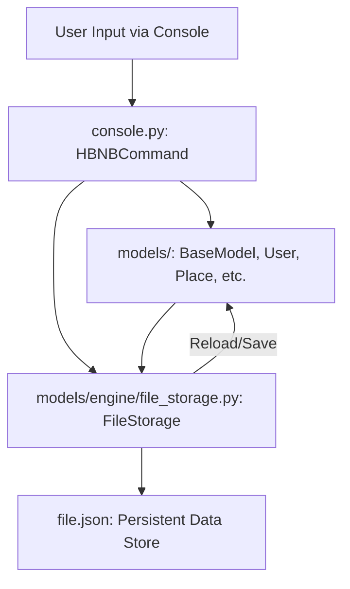
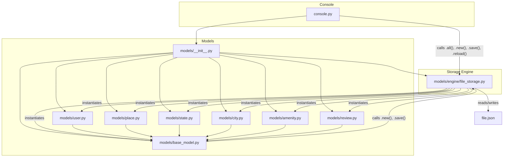

Project Name: HBNB AirBnB Clone v2

1. Repository Overview

Purpose: The HBNB project is the initial backend stage of an AirBnB clone, featuring a console interface for managing program data. This console allows users to create, update, and delete objects, with persistent storage achieved through JSON serialization/deserialization. The project aims to build a foundational command-line interface for an AirBnB-like application, demonstrating core object-oriented programming principles and file-based data persistence.

Key Features:

*   **Data Management:** Commands like `create`, `show`, `destroy`, `all`, and `update` allow manipulation of various object types (e.g., `BaseModel`, `User`, `Place`, `City`, `Amenity`, `State`, `Review`).
*   **File Storage:** A `FileStorage` class handles the persistent saving and loading of objects to and from a JSON file.
*   **Base Model:** A `BaseModel` defines common attributes and methods (e.g., `id`, `created_at`, `updated_at`, `save()`, `to_dict()`) inherited by all other models, ensuring consistency across data structures.
*   **Unit Testing:** All class-defining modules are unit tested, and code is PEP8 compliant, ensuring code quality and reliability.
*   **User Interface:** The console operates with a `(hbnb)` prompt, supporting both standard command syntax (e.g., `create BaseModel`) and an alternative, object-oriented syntax (e.g., `User.all()`, `User.update("<id>", {'name': 'Fred'})`).

Intended Audience / Users: This project is primarily intended for developers learning about backend development, object-oriented design in Python, and basic data persistence mechanisms. It serves as a foundational step for building more complex web applications.

Tech Stack Summary:

*   **Languages:** Python 3.x
*   **Frameworks:** Python's built-in `cmd` module for the command-line interface.
*   **Databases:** None (uses custom JSON file storage for persistence).
*   **Tools / Libraries:** `uuid` for unique IDs, `datetime` for timestamp management, `json` for serialization/deserialization.

2. 🧩 System Architecture

High-Level Design: The HBNB project follows a modular, object-oriented design centered around a command-line interface (CLI). The core architecture consists of:

1.  **Console (console.py):** The entry point and user interface, handling all user commands and interactions. It parses commands, validates inputs, and orchestrates actions on the data models.
2.  **Models (models/):** A set of Python classes representing various entities in the AirBnB domain (e.g., `User`, `Place`, `State`). All models inherit from a `BaseModel`, which provides common attributes and methods.
3.  **Storage Engine (models/engine/file_storage.py):** A dedicated module (`FileStorage`) responsible for abstracting the persistence layer. It handles the serialization of Python objects into JSON format and deserialization back into objects, storing them in a single `file.json`.

This architecture emphasizes a clear separation of concerns, where the console manages user interaction, models define data structures and behaviors, and the storage engine ensures data persistence.

Architecture Diagram (Mandatory)):



Core Modules:

### `console.py`

This is the main entry point of the application. It hosts the `HBNBCommand` class, which is a subclass of Python's `cmd.Cmd`. It interprets user commands, validates them against available classes and instances, and then delegates operations (create, show, destroy, update, all, count) to the `FileStorage` and model instances.

### `models/`

This directory contains the definitions for all data models used in the HBNB project.

*   **`models/base_model.py`**: Defines the `BaseModel` class, which serves as the parent class for all other models. It provides common attributes like `id`, `created_at`, `updated_at`, and methods for saving and converting objects to dictionary format.
*   **`models/user.py`**: Defines the `User` class, inheriting from `BaseModel`, with attributes specific to users (e.g., `email`, `password`, `first_name`, `last_name`).
*   **`models/state.py`**: Defines the `State` class, inheriting from `BaseModel`, with an attribute for the state `name`.
*   **`models/city.py`**: Defines the `City` class, inheriting from `BaseModel`, with attributes for `state_id` and `name`.
*   **`models/amenity.py`**: Defines the `Amenity` class, inheriting from `BaseModel`, with an attribute for the amenity `name`.
*   **`models/place.py`**: Defines the `Place` class, inheriting from `BaseModel`, representing a place with various attributes like `user_id`, `name`, `city_id`, `description`, `number_rooms`, `price_by_night`, etc.
*   **`models/review.py`**: Defines the `Review` class, inheriting from `BaseModel`, with attributes for `place_id`, `user_id`, and `text`.
*   **`models/__init__.py`**: Initializes the `FileStorage` instance and calls its `reload()` method to load existing objects from `file.json` when the package is imported.

### `models/engine/`

This directory contains the storage engine for the application.

*   **`models/engine/file_storage.py`**: Defines the `FileStorage` class, which manages the serialization and deserialization of objects to and from a JSON file (`file.json`). It provides methods to retrieve all stored objects (`all()`), add a new object (`new()`), save objects to file (`save()`), and load objects from file (`reload()`).

3. 🧱 Directory and File Structure

The repository has a straightforward structure, organizing models, the storage engine, and the console application.

Tree Representation:

```
AirBnB_clone_v2.git/
├── console.py
├── models/
│   ├── __init__.py
│   ├── base_model.py
│   ├── user.py
│   ├── state.py
│   ├── city.py
│   ├── amenity.py
│   ├── place.py
│   ├── review.py
│   └── engine/
│       ├── __init__.py
│       └── file_storage.py
├── tests/
│   ├── test_models/
│   │   ├── __init__.py
│   │   ├── test_base_model.py
│   │   ├── ... (other model tests)
│   │   └── test_engine/
│   │       ├── __init__.py
│   │       └── test_file_storage.py
├── web_static/ (Frontend assets - not fully integrated in this stage)
│   ├── styles/
│   ├── images/
│   └── ... (HTML files)
├── README.md
└── AUTHORS
```

File-Level Explanations:

*   `console.py` — This is the primary executable script for the HBNB command-line interpreter. It handles all user interactions, parses commands, and orchestrates the creation, retrieval, updating, and deletion of objects. It acts as the central control flow for the application.
*   `models/base_model.py` — Defines the `BaseModel` class, which is the foundational class for all other data models in the project. It encapsulates common attributes such as a unique `id`, `created_at` (timestamp of creation), and `updated_at` (timestamp of last update), along with methods for saving object state and converting objects to a dictionary representation.
*   `models/engine/file_storage.py` — Implements the `FileStorage` class, which is responsible for the persistence layer of the application. It serializes Python objects into a JSON file (`file.json`) for storage and deserializes them back into Python objects when the application starts. It manages the dictionary of all objects in memory.
*   `models/user.py` — Defines the `User` class, extending `BaseModel`, to represent user accounts with attributes like email, password, first name, and last name.
*   `models/state.py` — Defines the `State` class, extending `BaseModel`, to represent geographical states with a name attribute.
*   `models/city.py` — Defines the `City` class, extending `BaseModel`, to represent cities, linked to a `State` via `state_id` and having a name.
*   `models/amenity.py` — Defines the `Amenity` class, extending `BaseModel`, to represent amenities offered in a place (e.g., Wi-Fi, pool) with a name attribute.
*   `models/place.py` — Defines the `Place` class, extending `BaseModel`, to represent a rental property. It includes comprehensive attributes such as `city_id`, `user_id`, `name`, `description`, `number_rooms`, `number_bathrooms`, `max_guest`, `price_by_night`, `latitude`, `longitude`, and a list of `amenity_ids`.
*   `models/review.py` — Defines the `Review` class, extending `BaseModel`, to represent user reviews for a `Place`, including `place_id`, `user_id`, and the `text` of the review.

4. ⚙️ Code Components Documentation

4.1 Modules

### Name & Path: `models/base_model.py`

Purpose: This module provides the `BaseModel` class, which is the cornerstone of the HBNB data model. It defines the common interface and attributes that all other data models (User, Place, City, etc.) will inherit, ensuring a consistent structure and behavior across the application's objects. It handles the generation of unique IDs, manages creation and update timestamps, and provides methods for object serialization and deserialization.

Key Classes / Functions:

*   **Class: `BaseModel`**
    *   **Purpose:** The `BaseModel` class serves as the abstract base for all objects in the HBNB project. It initializes new instances with a unique `id` (using UUID4), `created_at`, and `updated_at` timestamps. It also handles the conversion of dictionary representations back into object instances, particularly useful during deserialization from storage.
    *   **Code Snippet:**
        ```python
        #!/usr/bin/python3
        """This module defines a base class for all models in our hbnb clone"""
        import uuid
        from datetime import datetime


        class BaseModel:
            """A base class for all hbnb models"""
            def __init__(self, *args, **kwargs):
                """Instatntiates a new model"""
                if not kwargs:
                    from models import storage
                    self.id = str(uuid.uuid4())
                    self.created_at = datetime.now()
                    self.updated_at = datetime.now()
                    storage.new(self)
                else:
                    kwargs['updated_at'] = datetime.strptime(kwargs['updated_at'],
                                                             '%Y-%m-%dT%H:%M:%S.%f')
                    kwargs['created_at'] = datetime.strptime(kwargs['created_at'],
                                                             '%Y-%m-%dT%H:%M:%S.%f')
                    del kwargs['__class__']
                    self.__dict__.update(kwargs)
        ```
    *   **Function: `save(self)`**
        *   **Purpose:** Updates the `updated_at` attribute to the current datetime and instructs the `storage` engine to save the current state of all objects to the persistent storage (file.json). This method is crucial for persisting changes made to an object.
        *   **Code Snippet:**
            ```python
            def save(self):
                """Updates updated_at with current time when instance is changed"""
                from models import storage
                self.updated_at = datetime.now()
                storage.save()
            ```
    *   **Function: `to_dict(self)`**
        *   **Purpose:** Converts the `BaseModel` instance into a dictionary representation. This dictionary includes all instance attributes, along with a `__class__` key storing the class name, and `created_at` and `updated_at` values formatted as ISO 8601 strings. This method is essential for serialization to JSON.
        *   **Code Snippet:**
            ```python
            def to_dict(self):
                """Convert instance into dict format"""
                dictionary = {}
                dictionary.update(self.__dict__)
                dictionary.update({'__class__':
                                  (str(type(self)).split('.')[-1]).split('\'')[0]})
                dictionary['created_at'] = self.created_at.isoformat()
                dictionary['updated_at'] = self.updated_at.isoformat()
                return dictionary
            ```

Dependencies:
*   Internal: `models.storage` (from `models/__init__.py`)
*   External: `uuid`, `datetime`

### Name & Path: `models/user.py`

Purpose: This module defines the `User` class, which inherits from `BaseModel` and represents a user within the HBNB system. It extends the base model with attributes specific to user accounts, such as email, password, and name details.

Key Classes / Functions: (See Class: `User` in section 4.2 for detailed documentation)

Dependencies:
*   Internal: `models.base_model.BaseModel`
*   External: None

### Name & Path: `models/state.py`

Purpose: This module defines the `State` class, inheriting from `BaseModel`. It represents geographical states, primarily holding a `name` attribute.

Key Classes / Functions: (See Class: `State` in section 4.2 for detailed documentation)

Dependencies:
*   Internal: `models.base_model.BaseModel`
*   External: None

### Name & Path: `models/city.py`

Purpose: This module defines the `City` class, which inherits from `BaseModel`. It represents cities within the HBNB system, linking them to a `State` through `state_id` and having a `name`.

Key Classes / Functions: (See Class: `City` in section 4.2 for detailed documentation)

Dependencies:
*   Internal: `models.base_model.BaseModel`
*   External: None

### Name & Path: `models/amenity.py`

Purpose: This module defines the `Amenity` class, inheriting from `BaseModel`. It represents amenities (e.g., Wi-Fi, pool) that can be associated with a `Place`, primarily holding a `name` attribute.

Key Classes / Functions: (See Class: `Amenity` in section 4.2 for detailed documentation)

Dependencies:
*   Internal: `models.base_model.BaseModel`
*   External: None

### Name & Path: `models/place.py`

Purpose: This module defines the `Place` class, inheriting from `BaseModel`. It represents a rental property in the HBNB system, containing comprehensive details about the listing, such as location, capacity, pricing, and associated amenities.

Key Classes / Functions: (See Class: `Place` in section 4.2 for detailed documentation)

Dependencies:
*   Internal: `models.base_model.BaseModel`
*   External: None

### Name & Path: `models/review.py`

Purpose: This module defines the `Review` class, inheriting from `BaseModel`. It represents user reviews for a `Place`, including the associated `place_id`, `user_id`, and the review `text`.

Key Classes / Functions: (See Class: `Review` in section 4.2 for detailed documentation)

Dependencies:
*   Internal: `models.base_model.BaseModel`
*   External: None

### Name & Path: `models/engine/file_storage.py`

Purpose: This module defines the `FileStorage` class, which is the serialization/deserialization engine for the HBNB project. It manages the storage of all HBNB models in a JSON file, providing methods to save new objects, retrieve all objects, and load objects from the file upon application startup.

Key Classes / Functions:

*   **Class: `FileStorage`**
    *   **Purpose:** The `FileStorage` class is responsible for the persistent storage of HBNB objects. It maintains a dictionary, `__objects`, in memory that stores all instantiated objects. It handles the conversion of these objects to a JSON format for saving to `file.json` and reconstructs them from `file.json` when the application is reloaded.
    *   **Code Snippet:**
        ```python
        #!/usr/bin/python3
        """This module defines a class to manage file storage for hbnb clone"""
        import json


        class FileStorage:
            """This class manages storage of hbnb models in JSON format"""
            __file_path = 'file.json'
            __objects = {}

            def all(self):
                """Returns a dictionary of models currently in storage"""
                return FileStorage.__objects

            def new(self, obj):
                """Adds new object to storage dictionary"""
                self.all().update({obj.to_dict()['__class__'] + '.' + obj.id: obj})

            def save(self):
                """Saves storage dictionary to file"""
                with open(FileStorage.__file_path, 'w') as f:
                    temp = {}
                    temp.update(FileStorage.__objects)
                    for key, val in temp.items():
                        temp[key] = val.to_dict()
                    json.dump(temp, f)

            def reload(self):
                """Loads storage dictionary from file"""
                from models.base_model import BaseModel
                from models.user import User
                from models.place import Place
                from models.state import State
                from models.city import City
                from models.amenity import Amenity
                from models.review import Review

                classes = {
                            'BaseModel': BaseModel, 'User': User, 'Place': Place,
                            'State': State, 'City': City, 'Amenity': Amenity,
                            'Review': Review
                          }
                try:
                    temp = {}
                    with open(FileStorage.__file_path, 'r') as f:
                        temp = json.load(f)
                        for key, val in temp.items():
                                self.all()[key] = classes[val['__class__']](**val)
                except FileNotFoundError:
                    pass
        ```

Dependencies:
*   Internal: `models.base_model.BaseModel`, `models.user.User`, `models.place.Place`, `models.state.State`, `models.city.City`, `models.amenity.Amenity`, `models.review.Review` (for `reload` method).
*   External: `json`

### Name & Path: `console.py`

Purpose: This module implements the `HBNBCommand` class, which is the command-line interpreter for the HBNB project. It provides a user-friendly interface to interact with the application's data models, allowing users to create, view, update, and delete objects without direct database access. It parses user input, validates commands and arguments, and dispatches operations to the `FileStorage` engine and model instances.

Key Classes / Functions:

*   **Class: `HBNBCommand`**
    *   **Purpose:** `HBNBCommand` is the main interactive shell for the HBNB project. It inherits from Python's `cmd.Cmd` and defines methods (prefixed with `do_`) that correspond to various commands available to the user (e.g., `create`, `show`, `destroy`, `all`, `update`, `quit`, `EOF`). It also includes logic for parsing advanced command syntax (dot notation) and provides help documentation for each command.
    *   **Code Snippet (Full Class):**
        ```python
        #!/usr/bin/python3
        """ Console Module """
        import cmd
        import sys
        from models.base_model import BaseModel
        from models.__init__ import storage
        from models.user import User
        from models.place import Place
        from models.state import State
        from models.city import City
        from models.amenity import Amenity
        from models.review import Review


        class HBNBCommand(cmd.Cmd):
            """ Contains the functionality for the HBNB console"""

            # determines prompt for interactive/non-interactive modes
            prompt = '(hbnb) ' if sys.__stdin__.isatty() else ''

            classes = {
                       'BaseModel': BaseModel, 'User': User, 'Place': Place,
                       'State': State, 'City': City, 'Amenity': Amenity,
                       'Review': Review
                      }
            dot_cmds = ['all', 'count', 'show', 'destroy', 'update']
            types = {
                     'number_rooms': int, 'number_bathrooms': int,
                     'max_guest': int, 'price_by_night': int,
                     'latitude': float, 'longitude': float
                    }

            def preloop(self):
                """Prints if isatty is false"""
                if not sys.__stdin__.isatty():
                    print('(hbnb)')

            def precmd(self, line):
                """Reformat command line for advanced command syntax.

                Usage: <class name>.<command>([<id> [<*args> or <**kwargs>]])
                (Brackets denote optional fields in usage example.)
                """
                _cmd = _cls = _id = _args = ''  # initialize line elements

                # scan for general formating - i.e '.', '(', ')'
                if not ('.' in line and '(' in line and ')' in line):
                    return line

                try:  # parse line left to right
                    pline = line[:]  # parsed line

                    # isolate <class name>
                    _cls = pline[:pline.find('.')]

                    # isolate and validate <command>
                    _cmd = pline[pline.find('.') + 1:pline.find('(')]
                    if _cmd not in HBNBCommand.dot_cmds:
                        raise Exception

                    # if parantheses contain arguments, parse them
                    pline = pline[pline.find('(') + 1:pline.find(')')]
                    if pline:
                        # partition args: (<id>, [<delim>], [<*args>])
                        pline = pline.partition(', ')  # pline convert to tuple

                        # isolate _id, stripping quotes
                        _id = pline[0].replace('\"', '')
                        # possible bug here:
                        # empty quotes register as empty _id when replaced

                        # if arguments exist beyond _id
                        pline = pline[2].strip()  # pline is now str
                        if pline:
                            # check for *args or **kwargs
                            if pline[0] is '{' and pline[-1] is'}'\
                                    and type(eval(pline)) is dict:
                                _args = pline
                            else:
                                _args = pline.replace(',', '')
                                # _args = _args.replace('\"', '')
                    line = ' '.join([_cmd, _cls, _id, _args])

                except Exception as mess:
                    pass
                finally:
                    return line

            def postcmd(self, stop, line):
                """Prints if isatty is false"""
                if not sys.__stdin__.isatty():
                    print('(hbnb) ', end='')
                return stop

            def do_quit(self, command):
                """ Method to exit the HBNB console"""
                exit()

            def help_quit(self):
                """ Prints the help documentation for quit  """
                print("Exits the program with formatting\\n")

            def do_EOF(self, arg):
                """ Handles EOF to exit program """
                print()
                exit()

            def help_EOF(self):
                """ Prints the help documentation for EOF """
                print("Exits the program without formatting\\n")

            def emptyline(self):
                """ Overrides the emptyline method of CMD """
                pass

            def do_create(self, args):
                """ Create an object of any class"""
                if not args:
                    print("** class name missing **")
                    return
                elif args not in HBNBCommand.classes:
                    print("** class doesn't exist **")
                    return
                new_instance = HBNBCommand.classes[args]()
                storage.save()
                print(new_instance.id)
                storage.save()

            def help_create(self):
                """ Help information for the create method """
                print("Creates a class of any type")
                print("[Usage]: create <className>\\n")

            def do_show(self, args):
                """ Method to show an individual object """
                new = args.partition(" ")
                c_name = new[0]
                c_id = new[2]

                # guard against trailing args
                if c_id and ' ' in c_id:
                    c_id = c_id.partition(' ')[0]

                if not c_name:
                    print("** class name missing **")
                    return

                if c_name not in HBNBCommand.classes:
                    print("** class doesn't exist **")
                    return

                if not c_id:
                    print("** instance id missing **")
                    return

                key = c_name + "." + c_id
                try:
                    print(storage._FileStorage__objects[key])
                except KeyError:
                    print("** no instance found **")

            def help_show(self):
                """ Help information for the show command """
                print("Shows an individual instance of a class")
                print("[Usage]: show <className> <objectId>\\n")

            def do_destroy(self, args):
                """ Destroys a specified object """
                new = args.partition(" ")
                c_name = new[0]
                c_id = new[2]
                if c_id and ' ' in c_id:
                    c_id = c_id.partition(' ')[0]

                if not c_name:
                    print("** class name missing **")
                    return

                if c_name not in HBNBCommand.classes:
                    print("** class doesn't exist **")
                    return

                if not c_id:
                    print("** instance id missing **")
                    return

                key = c_name + "." + c_id

                try:
                    del(storage.all()[key])
                    storage.save()
                except KeyError:
                    print("** no instance found **")

            def help_destroy(self):
                """ Help information for the destroy command """
                print("Destroys an individual instance of a class")
                print("[Usage]: destroy <className> <objectId>\\n")

            def do_all(self, args):
                """ Shows all objects, or all objects of a class"""
                print_list = []

                if args:
                    args = args.split(' ')[0]  # remove possible trailing args
                    if args not in HBNBCommand.classes:
                        print("** class doesn't exist **")
                        return
                    for k, v in storage._FileStorage__objects.items():
                        if k.split('.')[0] == args:
                            print_list.append(str(v))
                else:
                    for k, v in storage._FileStorage__objects.items():
                        print_list.append(str(v))

                print(print_list)

            def help_all(self):
                """ Help information for the all command """
                print("Shows all objects, or all of a class")
                print("[Usage]: all <className>\\n")

            def do_count(self, args):
                """Count current number of class instances"""
                count = 0
                for k, v in storage._FileStorage__objects.items():
                    if args == k.split('.')[0]:
                        count += 1
                print(count)

            def help_count(self):
                """ """
                print("Usage: count <class_name>")

            def do_update(self, args):
                """ Updates a certain object with new info """
                c_name = c_id = att_name = att_val = kwargs = ''

                # isolate cls from id/args, ex: (<cls>, delim, <id/args>)
                args = args.partition(" ")
                if args[0]:
                    c_name = args[0]
                else:  # class name not present
                    print("** class name missing **")
                    return
                if c_name not in HBNBCommand.classes:  # class name invalid
                    print("** class doesn't exist **")
                    return

                # isolate id from args
                args = args[2].partition(" ")
                if args[0]:
                    c_id = args[0]
                else:  # id not present
                    print("** instance id missing **")
                    return

                # generate key from class and id
                key = c_name + "." + c_id

                # determine if key is present
                if key not in storage.all():
                    print("** no instance found **")
                    return

                # first determine if kwargs or args
                if '{' in args[2] and '}' in args[2] and type(eval(args[2])) is dict:
                    kwargs = eval(args[2])
                    args = []  # reformat kwargs into list, ex: [<name>, <value>, ...]
                    for k, v in kwargs.items():
                        args.append(k)
                        args.append(v)
                else:  # isolate args
                    args = args[2]
                    if args and args[0] is '\"':  # check for quoted arg
                        second_quote = args.find('\"', 1)
                        att_name = args[1:second_quote]
                        args = args[second_quote + 1:]

                    args = args.partition(' ')

                    # if att_name was not quoted arg
                    if not att_name and args[0] is not ' ':
                        att_name = args[0]
                    # check for quoted val arg
                    if args[2] and args[2][0] is '\"':
                        att_val = args[2][1:args[2].find('\"', 1)]

                    # if att_val was not quoted arg
                    if not att_val and args[2]:
                        att_val = args[2].partition(' ')[0]

                    args = [att_name, att_val]

                # retrieve dictionary of current objects
                new_dict = storage.all()[key]

                # iterate through attr names and values
                for i, att_name in enumerate(args):
                    # block only runs on even iterations
                    if (i % 2 == 0):
                        att_val = args[i + 1]  # following item is value
                        if not att_name:  # check for att_name
                            print("** attribute name missing **")
                            return
                        if not att_val:  # check for att_value
                            print("** value missing **")
                            return
                        # type cast as necessary
                        if att_name in HBNBCommand.types:
                            att_val = HBNBCommand.types[att_name](att_val)

                        # update dictionary with name, value pair
                        new_dict.__dict__.update({att_name: att_val})

                new_dict.save()  # save updates to file

            def help_update(self):
                """ Help information for the update class """
                print("Updates an object with new information")
                print("Usage: update <className> <id> <attName> <attVal>\\n")

        if __name__ == "__main__":
            HBNBCommand().cmdloop()
        ```
    *   **Function: `precmd(self, line)`**
        *   **Purpose:** This method is a hook that processes the command line before it is dispatched to the `do_*` methods. It's specifically implemented to handle the "dot notation" syntax (e.g., `User.all()`, `Place.show("id")`), converting it into the standard command format (`all User`, `show Place id`) that the `do_*` methods expect.
        *   **Inputs:** `line` (str) - The raw command line input from the user.
        *   **Outputs:** `line` (str) - The reformatted command line.
        *   **Code Snippet:**
            ```python
            def precmd(self, line):
                """Reformat command line for advanced command syntax.

                Usage: <class name>.<command>([<id> [<*args> or <**kwargs>]])
                (Brackets denote optional fields in usage example.)
                """
                _cmd = _cls = _id = _args = ''  # initialize line elements

                # scan for general formating - i.e '.', '(', ')'
                if not ('.' in line and '(' in line and ')' in line):
                    return line

                try:  # parse line left to right
                    pline = line[:]  # parsed line

                    # isolate <class name>
                    _cls = pline[:pline.find('.')]

                    # isolate and validate <command>
                    _cmd = pline[pline.find('.') + 1:pline.find('(')]
                    if _cmd not in HBNBCommand.dot_cmds:
                        raise Exception

                    # if parantheses contain arguments, parse them
                    pline = pline[pline.find('(') + 1:pline.find(')')]
                    if pline:
                        # partition args: (<id>, [<delim>], [<*args>])
                        pline = pline.partition(', ')  # pline convert to tuple

                        # isolate _id, stripping quotes
                        _id = pline[0].replace('\"', '')
                        # possible bug here:
                        # empty quotes register as empty _id when replaced

                        # if arguments exist beyond _id
                        pline = pline[2].strip()  # pline is now str
                        if pline:
                            # check for *args or **kwargs
                            if pline[0] is '{' and plpe[-1] is'}'\
                                    and type(eval(pline)) is dict:
                                _args = pline
                            else:
                                _args = pline.replace(',', '')
                                # _args = _args.replace('\"', '')
                    line = ' '.join([_cmd, _cls, _id, _args])

                except Exception as mess:
                    pass
                finally:
                    return line
            ```
    *   **Function: `do_create(self, args)`**
        *   **Purpose:** Creates a new instance of a specified class, saves it to storage, and prints its unique ID. It performs validation to ensure a class name is provided and that the class exists.
        *   **Inputs:** `args` (str) - The class name (e.g., "BaseModel", "User").
        *   **Outputs:** Prints the ID of the new instance, or error messages.
        *   **Raises:** Implicitly handles `KeyError` if class name is invalid by printing an error.
        *   **Code Snippet:**
            ```python
            def do_create(self, args):
                """ Create an object of any class"""
                if not args:
                    print("** class name missing **")
                    return
                elif args not in HBNBCommand.classes:
                    print("** class doesn't exist **")
                    return
                new_instance = HBNBCommand.classes[args]()
                storage.save()
                print(new_instance.id)
                storage.save()
            ```
    *   **Function: `do_show(self, args)`**
        *   **Purpose:** Displays the string representation of an object given its class name and ID. It validates inputs and retrieves the object from `storage`.
        *   **Inputs:** `args` (str) - A string containing the class name and instance ID, separated by a space.
        *   **Outputs:** Prints the string representation of the object, or error messages.
        *   **Code Snippet:**
            ```python
            def do_show(self, args):
                """ Method to show an individual object """
                new = args.partition(" ")
                c_name = new[0]
                c_id = new[2]

                # guard against trailing args
                if c_id and ' ' in c_id:
                    c_id = c_id.partition(' ')[0]

                if not c_name:
                    print("** class name missing **")
                    return

                if c_name not in HBNBCommand.classes:
                    print("** class doesn't exist **")
                    return

                if not c_id:
                    print("** instance id missing **")
                    return

                key = c_name + "." + c_id
                try:
                    print(storage._FileStorage__objects[key])
                except KeyError:
                    print("** no instance found **")
            ```
    *   **Function: `do_destroy(self, args)`**
        *   **Purpose:** Deletes an object from storage based on its class name and ID. It validates inputs and updates the persistent storage.
        *   **Inputs:** `args` (str) - A string containing the class name and instance ID.
        *   **Outputs:** No direct output on success; prints error messages if the class or instance is not found.
        *   **Code Snippet:**
            ```python
            def do_destroy(self, args):
                """ Destroys a specified object """
                new = args.partition(" ")
                c_name = new[0]
                c_id = new[2]
                if c_id and ' ' in c_id:
                    c_id = c_id.partition(' ')[0]

                if not c_name:
                    print("** class name missing **")
                    return

                if c_name not in HBNBCommand.classes:
                    print("** class doesn't exist **")
                    return

                if not c_id:
                    print("** instance id missing **")
                    return

                key = c_name + "." + c_id

                try:
                    del(storage.all()[key])
                    storage.save()
                except KeyError:
                    print("** no instance found **")
            ```
    *   **Function: `do_all(self, args)`**
        *   **Purpose:** Displays the string representation of all stored objects, or all objects of a specified class.
        *   **Inputs:** `args` (str, optional) - The class name to filter objects. If empty, all objects are shown.
        *   **Outputs:** Prints a list of string representations of the objects.
        *   **Code Snippet:**
            ```python
            def do_all(self, args):
                """ Shows all objects, or all objects of a class"""
                print_list = []

                if args:
                    args = args.split(' ')[0]  # remove possible trailing args
                    if args not in HBNBCommand.classes:
                        print("** class doesn't exist **")
                        return
                    for k, v in storage._FileStorage__objects.items():
                        if k.split('.')[0] == args:
                            print_list.append(str(v))
                else:
                    for k, v in storage._FileStorage__objects.items():
                        print_list.append(str(v))

                print(print_list)
            ```
    *   **Function: `do_update(self, args)`**
        *   **Purpose:** Updates attributes of a specified object. It supports updating individual attributes or multiple attributes using a dictionary. It handles type casting for specific attributes.
        *   **Inputs:** `args` (str) - Contains class name, instance ID, attribute name, and attribute value (or a dictionary of attributes).
        *   **Outputs:** No direct output on success; prints error messages for missing class, ID, attribute name, or value.
        *   **Code Snippet:**
            ```python
            def do_update(self, args):
                """ Updates a certain object with new info """
                c_name = c_id = att_name = att_val = kwargs = ''

                # isolate cls from id/args, ex: (<cls>, delim, <id/args>)
                args = args.partition(" ")
                if args[0]:
                    c_name = args[0]
                else:  # class name not present
                    print("** class name missing **")
                    return
                if c_name not in HBNBCommand.classes:  # class name invalid
                    print("** class doesn't exist **")
                    return

                # isolate id from args
                args = args[2].partition(" ")
                if args[0]:
                    c_id = args[0]
                else:  # id not present
                    print("** instance id missing **")
                    return

                # generate key from class and id
                key = c_name + "." + c_id

                # determine if key is present
                if key not in storage.all():
                    print("** no instance found **")
                    return

                # first determine if kwargs or args
                if '{' in args[2] and '}' in args[2] and type(eval(args[2])) is dict:
                    kwargs = eval(args[2])
                    args = []  # reformat kwargs into list, ex: [<name>, <value>, ...]
                    for k, v in kwargs.items():
                        args.append(k)
                        args.append(v)
                else:  # isolate args
                    args = args[2]
                    if args and args[0] is '\"':  # check for quoted arg
                        second_quote = args.find('\"', 1)
                        att_name = args[1:second_quote]
                        args = args[second_quote + 1:]

                    args = args.partition(' ')

                    # if att_name was not quoted arg
                    if not att_name and args[0] is not ' ':
                        att_name = args[0]
                    # check for quoted val arg
                    if args[2] and args[2][0] is '\"':
                        att_val = args[2][1:args[2].find('\"', 1)]

                    # if att_val was not quoted arg
                    if not att_val and args[2]:
                        att_val = args[2].partition(' ')[0]

                    args = [att_name, att_val]

                # retrieve dictionary of current objects
                new_dict = storage.all()[key]

                # iterate through attr names and values
                for i, att_name in enumerate(args):
                    # block only runs on even iterations
                    if (i % 2 == 0):
                        att_val = args[i + 1]  # following item is value
                        if not att_name:  # check for att_name
                            print("** attribute name missing **")
                            return
                        if not att_val:  # check for att_value
                            print("** value missing **")
                            return
                        # type cast as necessary
                        if att_name in HBNBCommand.types:
                            att_val = HBNBCommand.types[att_name](att_val)

                        # update dictionary with name, value pair
                        new_dict.__dict__.update({att_name: att_val})

                new_dict.save()  # save updates to file
            ```

Dependencies:
*   Internal: `models.base_model.BaseModel`, `models.user.User`, `models.place.Place`, `models.state.State`, `models.city.City`, `models.amenity.Amenity`, `models.review.Review`, `models.storage` (from `models/__init__.py`).
*   External: `cmd`, `sys`.

4.2 Classes

### Name & Path: `models/base_model.py`

Code Snippets:
```python
#!/usr/bin/python3
"""This module defines a base class for all models in our hbnb clone"""
import uuid
from datetime import datetime


class BaseModel:
    """A base class for all hbnb models"""
    def __init__(self, *args, **kwargs):
        """Instatntiates a new model"""
        if not kwargs:
            from models import storage
            self.id = str(uuid.uuid4())
            self.created_at = datetime.now()
            self.updated_at = datetime.now()
            storage.new(self)
        else:
            kwargs['updated_at'] = datetime.strptime(kwargs['updated_at'],
                                                     '%Y-%m-%dT%H:%M:%S.%f')
            kwargs['created_at'] = datetime.strptime(kwargs['created_at'],
                                                     '%Y-%m-%dT%H:%M:%S.%f')
            del kwargs['__class__']
            self.__dict__.update(kwargs)

    def __str__(self):
        """Returns a string representation of the instance"""
        cls = (str(type(self)).split('.')[-1]).split('\'')[0]
        return '[{}] ({}) {}'.format(cls, self.id, self.__dict__)

    def save(self):
        """Updates updated_at with current time when instance is changed"""
        from models import storage
        self.updated_at = datetime.now()
        storage.save()

    def to_dict(self):
        """Convert instance into dict format"""
        dictionary = {}
        dictionary.update(self.__dict__)
        dictionary.update({'__class__':
                          (str(type(self)).split('.')[-1]).split('\'')[0]})
        dictionary['created_at'] = self.created_at.isoformat()
        dictionary['updated_at'] = self.updated_at.isoformat()
        return dictionary
```

Description: The `BaseModel` class serves as the fundamental building block for all data objects within the HBNB application. It provides a standardized set of attributes and behaviors that are common across different entities like `User`, `Place`, `State`, etc. This class ensures that every object has a unique identifier, tracks its creation and last update times, and can be easily converted to and from a dictionary representation for storage and retrieval.

Attributes:

*   `id` (str): A unique identifier for each instance, generated using `uuid.uuid4()`.
*   `created_at` (datetime): The timestamp indicating when an instance was created.
*   `updated_at` (datetime): The timestamp indicating the last time an instance was updated.

Methods:

| Method      | Parameters | Returns      | Description                                                                                                                                                                                                                                                                                                                                   |
| :---------- | :--------- | :----------- | :-------------------------------------------------------------------------------------------------------------------------------------------------------------------------------------------------------------------------------------------------------------------------------------------------------------------------------------------- |
| `__init__`  | `*args`, `**kwargs` | `None`       | Initializes a new `BaseModel` instance. If `kwargs` are provided (typically during deserialization), it reconstructs the object from a dictionary. Otherwise, it generates a new `id`, `created_at`, and `updated_at` timestamp, and registers the new object with the `FileStorage` engine.                                                |
| `__str__`   | `self`     | `str`        | Returns a human-readable string representation of the `BaseModel` instance, formatted as `[<class name>] (<id>) <__dict__>`. This is useful for debugging and displaying object information in the console.                                                                                                                                  |
| `save`      | `self`     | `None`       | Updates the `updated_at` attribute to the current datetime and then calls the `save()` method of the global `storage` instance (`FileStorage`) to persist all current objects to `file.json`. This method is essential for saving any changes made to an object.                                                                             |
| `to_dict`   | `self`     | `dict`       | Converts the `BaseModel` instance into a dictionary. This dictionary includes all attributes of the instance, an additional `__class__` key with the class name, and `created_at` and `updated_at` converted to ISO 8601 string format. This method is critical for serializing objects to JSON for storage.                                     |

### Name & Path: `models/user.py`

Code Snippets:
```python
#!/usr/bin/python3
"""This module defines a class User"""
from models.base_model import BaseModel


class User(BaseModel):
    """This class defines a user by various attributes"""
    email = ''
    password = ''
    first_name = ''
    last_name = ''
```

Description: The `User` class represents a user of the HBNB application. It inherits all common attributes and methods from `BaseModel` and adds specific attributes to define a user's profile, such as their email, password, first name, and last name.

Attributes:

*   `email` (str): The email address of the user.
*   `password` (str): The password associated with the user's account.
*   `first_name` (str): The first name of the user.
*   `last_name` (str): The last name of the user.

Methods: Inherits all methods from `BaseModel` (e.g., `__init__`, `save`, `to_dict`).

### Name & Path: `models/state.py`

Code Snippets:
```python
#!/usr/bin/python3
""" State Module for HBNB project """
from models.base_model import BaseModel


class State(BaseModel):
    """ State class """
    name = ""
```

Description: The `State` class represents a geographical state within the HBNB system. It inherits from `BaseModel` and includes a single attribute to store the name of the state.

Attributes:

*   `name` (str): The name of the state.

Methods: Inherits all methods from `BaseModel`.

### Name & Path: `models/city.py`

Code Snippets:
```python
#!/usr/bin/python3
""" City Module for HBNB project """
from models.base_model import BaseModel


class City(BaseModel):
    """ The city class, contains state ID and name """
    state_id = ""
    name = ""
```

Description: The `City` class represents a city, a geographical entity within a `State`. It inherits from `BaseModel` and has attributes to link it to a specific state and store its name.

Attributes:

*   `state_id` (str): The ID of the `State` to which the city belongs.
*   `name` (str): The name of the city.

Methods: Inherits all methods from `BaseModel`.

### Name & Path: `models/amenity.py`

Code Snippets:
```python
#!/usr/bin/python3
""" State Module for HBNB project """
from models.base_model import BaseModel


class Amenity(BaseModel):
    name = ""
```

Description: The `Amenity` class represents a facility or service provided at a `Place` (e.g., Wi-Fi, swimming pool). It inherits from `BaseModel` and has a `name` attribute to describe the amenity.

Attributes:

*   `name` (str): The name of the amenity.

Methods: Inherits all methods from `BaseModel`.

### Name & Path: `models/place.py`

Code Snippets:
```python
#!/usr/bin/python3
""" Place Module for HBNB project """
from models.base_model import BaseModel


class Place(BaseModel):
    """ A place to stay """
    city_id = ""
    user_id = ""
    name = ""
    description = ""
    number_rooms = 0
    number_bathrooms = 0
    max_guest = 0
    price_by_night = 0
    latitude = 0.0
    longitude = 0.0
    amenity_ids = []
```

Description: The `Place` class represents a rental property listing in the HBNB application. It inherits from `BaseModel` and includes a comprehensive set of attributes to describe the property, its location, features, and pricing.

Attributes:

*   `city_id` (str): The ID of the `City` where the place is located.
*   `user_id` (str): The ID of the `User` who owns or listed the place.
*   `name` (str): The name or title of the place.
*   `description` (str): A detailed description of the place.
*   `number_rooms` (int): The total number of rooms available.
*   `number_bathrooms` (int): The total number of bathrooms.
*   `max_guest` (int): The maximum number of guests the place can accommodate.
*   `price_by_night` (int): The price per night for staying at the place.
*   `latitude` (float): The geographical latitude coordinate of the place.
*   `longitude` (float): The geographical longitude coordinate of the place.
*   `amenity_ids` (list of str): A list of IDs of `Amenity` objects associated with the place.

Methods: Inherits all methods from `BaseModel`.

### Name & Path: `models/review.py`

Code Snippets:
```python
#!/usr/bin/python3
""" Review module for the HBNB project """
from models.base_model import BaseModel


class Review(BaseModel):
    """ Review classto store review information """
    place_id = ""
    user_id = ""
    text = ""
```

Description: The `Review` class represents a user's review for a specific `Place`. It inherits from `BaseModel` and includes attributes to link the review to a place and a user, as well as the actual text content of the review.

Attributes:

*   `place_id` (str): The ID of the `Place` being reviewed.
*   `user_id` (str): The ID of the `User` who wrote the review.
*   `text` (str): The content of the review.

Methods: Inherits all methods from `BaseModel`.

### Name & Path: `models/engine/file_storage.py`

Code Snippets:
```python
#!/usr/bin/python3
"""This module defines a class to manage file storage for hbnb clone"""
import json


class FileStorage:
    """This class manages storage of hbnb models in JSON format"""
    __file_path = 'file.json'
    __objects = {}

    def all(self):
        """Returns a dictionary of models currently in storage"""
        return FileStorage.__objects

    def new(self, obj):
        """Adds new object to storage dictionary"""
        self.all().update({obj.to_dict()['__class__'] + '.' + obj.id: obj})

    def save(self):
        """Saves storage dictionary to file"""
        with open(FileStorage.__file_path, 'w') as f:
            temp = {}
            temp.update(FileStorage.__objects)
            for key, val in temp.items():
                temp[key] = val.to_dict()
            json.dump(temp, f)

    def reload(self):
        """Loads storage dictionary from file"""
        from models.base_model import BaseModel
        from models.user import User
        from models.place import Place
        from models.state import State
        from models.city import City
        from models.amenity import Amenity
        from models.review import Review

        classes = {
                    'BaseModel': BaseModel, 'User': User, 'Place': Place,
                    'State': State, 'City': City, 'Amenity': Amenity,
                    'Review': Review
                  }
        try:
            temp = {}
            with open(FileStorage.__file_path, 'r') as f:
                temp = json.load(f)
                for key, val in temp.items():
                        self.all()[key] = classes[val['__class__']](**val)
        except FileNotFoundError:
            pass
```

Description: The `FileStorage` class is the designated component for handling data persistence in the HBNB project. It acts as an intermediary between the application's in-memory objects and the permanent storage on disk, which is a JSON file named `file.json`. This class provides the mechanisms to store, retrieve, add, and save all the different types of `BaseModel` objects.

Attributes:

*   `__file_path` (str): A private class attribute storing the path to the JSON file where objects are saved (`'file.json'`).
*   `__objects` (dict): A private class attribute, a dictionary that stores all instantiated objects currently loaded in memory. Keys are in the format `<class name>.<object id>`, and values are the actual object instances.

Methods:

| Method   | Parameters | Returns | Description                                                                                                                                                                                                                                                                                                                                                                                                                                                                                                      |
| :------- | :--------- | :------ | :--------------------------------------------------------------------------------------------------------------------------------------------------------------------------------------------------------------------------------------------------------------------------------------------------------------------------------------------------------------------------------------------------------------------------------------------------------------------------------------------------------------- |
| `all`    | `self`     | `dict`  | Returns the `__objects` dictionary, which contains all currently stored models. This provides access to all the objects managed by the storage engine.                                                                                                                                                                                                                                                                                                                                                              |
| `new`    | `self`, `obj` | `None`  | Adds a new object (`obj`) to the `__objects` dictionary. The key for the object is constructed using its class name and ID (`obj.to_dict()['__class__'] + '.' + obj.id`). This method is called whenever a new `BaseModel` instance (or any of its subclasses) is created.                                                                                                                                                                                                                                         |
| `save`   | `self`     | `None`  | Serializes the `__objects` dictionary into JSON format and saves it to the file specified by `__file_path`. Before saving, each object in `__objects` is converted to its dictionary representation using its `to_dict()` method. This ensures that all object data is correctly stored in a human-readable and reconstructible format.                                                                                                                                                                     |
| `reload` | `self`     | `None`  | Deserializes the JSON file (`__file_path`) back into the `__objects` dictionary. It reads the JSON file, and for each dictionary representation, it reconstructs the original Python object using the appropriate class (determined by the `__class__` key in the dictionary) and its `__init__` method. This method is called at the application's startup to load any previously saved data. It gracefully handles `FileNotFoundError` if `file.json` does not exist.                                     |

4.3 Functions
(Functions are primarily methods within the `HBNBCommand` class and `BaseModel` and `FileStorage` classes, already documented above.)

5. 🔄 Data Flow and Dependencies

Execution Flow:

The HBNB application's execution flow is driven by the `console.py` script. When the script is run, it initializes the `FileStorage` engine (via `models/__init__.py`), which attempts to load any existing objects from `file.json`. Then, the `HBNBCommand` interpreter starts, presenting the `(hbnb)` prompt to the user.

1.  **User Input:** The user types a command (e.g., `create User`, `show BaseModel 123`, `User.all()`) into the console.
2.  **Command Pre-processing (`HBNBCommand.precmd`):** If the command uses dot notation (e.g., `User.all()`), the `precmd` method in `HBNBCommand` parses and reformats it into the standard command syntax (e.g., `all User`).
3.  **Command Dispatch (`HBNBCommand.do_*` methods):** The `cmd` module dispatches the processed command to the corresponding `do_*` method in `HBNBCommand` (e.g., `do_create`, `do_show`).
4.  **Action on Models:**
    *   **Create:** `do_create` instantiates a new object of the specified class (e.g., `User()`). During `BaseModel`'s `__init__`, the new object is automatically added to `FileStorage.__objects` via `storage.new(self)`.
    *   **Show/Destroy/Update/All/Count:** These methods access or modify objects directly from `storage._FileStorage__objects` (the in-memory dictionary of objects).
5.  **Persistence (`BaseModel.save()` and `FileStorage.save()`):**
    *   Whenever an object is created or updated, its `save()` method is called.
    *   `BaseModel.save()` updates the object's `updated_at` timestamp and then calls `storage.save()`.
    *   `FileStorage.save()` serializes the entire `FileStorage.__objects` dictionary (converting each object to its `to_dict()` representation) into `file.json`.
6.  **Object Retrieval (`FileStorage.all()` and `FileStorage.reload()`):**
    *   `FileStorage.all()` provides access to the current in-memory objects.
    *   `FileStorage.reload()` is called at startup to load objects from `file.json` and reconstruct them into Python object instances, populating `FileStorage.__objects`.
7.  **Output:** The `do_*` methods print relevant information (e.g., object IDs, string representations, error messages) back to the console.

Dependency Graph:



External Integrations:

*   **`cmd` module:** Python's built-in module for creating line-oriented command interpreters. `console.py` leverages this for its interactive shell.
*   **`sys` module:** Used in `console.py` to check if stdin is a TTY (interactive mode) to determine the prompt behavior.
*   **`uuid` module:** Used in `base_model.py` to generate universally unique identifiers for each object instance.
*   **`datetime` module:** Used in `base_model.py` to manage `created_at` and `updated_at` timestamps, and in `file_storage.py` for `strptime` during deserialization.
*   **`json` module:** Used in `file_storage.py` for serializing Python dictionaries to JSON format and deserializing JSON back into Python dictionaries.

6. 🧪 Testing & Quality Assurance

Test Framework: The project uses Python's built-in `unittest` framework for its test suite.

Structure: The `tests/` directory mirrors the `models/` directory structure, providing comprehensive unit tests for each model and the storage engine.

*   `tests/unit/` — No explicit `unit` directory, but `tests/test_models/` serves this purpose.
*   `tests/integration/` — No explicit integration tests beyond the comprehensive unit tests that cover interactions.

The primary testing directories are:

*   `tests/test_models/`: Contains unit tests for `BaseModel` and all its subclasses (`User`, `Place`, `State`, `City`, `Amenity`, `Review`).
*   `tests/test_models/test_engine/`: Contains unit tests specifically for the `FileStorage` class.

Example Test:

Here's an example test from `tests/test_models/test_base_model.py` demonstrating how `BaseModel`'s default initialization and `save` method are tested.

```python
class test_basemodel(unittest.TestCase):
    def __init__(self, *args, **kwargs):
        super().__init__(*args, **kwargs)
        self.name = 'BaseModel'
        self.value = BaseModel

    def setUp(self):
        pass

    def tearDown(self):
        try:
            os.remove('file.json')
        except:
            pass

    def test_default(self):
        """ """
        i = self.value()
        self.assertEqual(type(i), self.value)

    def test_kwargs(self):
        """ """
        i = self.value()
        copy = i.to_dict()
        new = BaseModel(**copy)
        self.assertFalse(new is i)

    def test_save(self):
        """ Testing save """
        i = self.value()
        i.save()
        key = self.name + "." + i.id
        with open('file.json', 'r') as f:
            j = json.load(f)
            self.assertEqual(j[key], i.to_dict())
```

Coverage Notes: According to the `readme_summary`, all class-defining modules are unit tested, indicating a good level of test coverage for the core data models and storage logic. The presence of specific test files for each model and the storage engine (`test_base_model.py`, `test_user.py`, `test_file_storage.py`, etc.) confirms this commitment to testing.

7. 🧰 Setup and Configuration

Requirements / Dependencies:

*   **Python 3.x:** The project is developed in Python 3.
*   No specific external libraries are listed beyond standard Python modules (`cmd`, `sys`, `uuid`, `datetime`, `json`), so a basic Python installation should suffice.

Installation Steps:

1.  **Clone the repository:**
    ```bash
    git clone https://github.com/kiptuidenis/AirBnB_clone_v2.git
    cd AirBnB_clone_v2.git
    ```

2.  **Run the console:**
    ```bash
    ./console.py
    ```
    or
    ```bash
    python3 console.py
    ```

Environment Variables:
No specific environment variables are explicitly required or mentioned for the console application.

Run Instructions:
Once the repository is cloned, navigate to the project's root directory in your terminal and execute the `console.py` script. This will launch the HBNB command-line interpreter, presenting you with the `(hbnb)` prompt.

```bash
python3 console.py
(hbnb)
```

8. 🚀 Usage Guide

CLI Commands:

*   `create <class_name>`:
    *   **Description:** Creates a new instance of the specified class. The new object is saved to storage, and its unique ID is printed.
    *   **Example:** `create User`

*   `show <class_name> <_id>`:
    *   **Description:** Displays the string representation of an object given its class name and ID.
    *   **Example:** `show User 1234-5678-9101`

*   `destroy <class_name> <_id>`:
    *   **Description:** Deletes an object from storage based on its class name and ID.
    *   **Example:** `destroy Place 1122-3344-5566`

*   `all`:
    *   **Description:** Displays the string representation of all stored objects.
    *   **Example:** `all`

*   `all <class_name>`:
    *   **Description:** Displays the string representation of all objects of a specified class.
    *   **Example:** `all State`

*   `update <class_name> <_id> <attribute_name> <attribute_value>`:
    *   **Description:** Updates an attribute of a specified object. The `attribute_value` can be a string, integer, or float.
    *   **Example:** `update User 1234-5678-9101 first_name "John"`

*   `update <class_name> <_id> <dictionary>`:
    *   **Description:** Updates an object's attributes using a dictionary.
    *   **Example:** `update User 1234-5678-9101 {"first_name": "Jane", "last_name": "Doe"}`

*   `count <class_name>`:
    *   **Description:** Counts and prints the number of instances of a given class.
    *   **Example:** `count User`

*   `quit`:
    *   **Description:** Exits the HBNB console.
    *   **Example:** `quit`

*   `EOF`:
    *   **Description:** (End-Of-File) Exits the program. Can be triggered by Ctrl+D.
    *   **Example:** (Press Ctrl+D)

Alternative Syntax (Dot Notation):
The `all`, `count`, `show`, `destroy`, and `update` commands can also be used with a dot notation:

*   `<class_name>.<command>()`
    *   Example: `User.all()`
    *   Example: `State.count()`
    *   Example: `Place.show("1122-3344-5566")`
    *   Example: `User.update("1234-5678-9101", "first_name", "Jane")`
    *   Example: `User.update("1234-5678-9101", {"first_name": "Jane", "last_name": "Doe"})`

Expected Outputs / Example Runs:

```bash
$ python3 console.py
(hbnb) create BaseModel
b6a7a8d9-0c1d-4e2f-3a4b-5c6d7e8f9a0b
(hbnb) show BaseModel b6a7a8d9-0c1d-4e2f-3a4b-5c6d7e8f9a0b
[BaseModel] (b6a7a8d9-0c1d-4e2f-3a4b-5c6d7e8f9a0b) {'id': 'b6a7a8d9-0c1d-4e2f-3a4b-5c6d7e8f9a0b', 'created_at': datetime.datetime(2023, 10, 27, 10, 30, 0, 123456), 'updated_at': datetime.datetime(2023, 10, 27, 10, 30, 0, 123456)}
(hbnb) all BaseModel
["[BaseModel] (b6a7a8d9-0c1d-4e2f-3a4b-5c6d7e8f9a0b) {'id': 'b6a7a8d9-0c1d-4e2f-3a4b-5c6d7e8f9a0b', 'created_at': '2023-10-27T10:30:00.123456', 'updated_at': '2023-10-27T10:30:00.123456'}"]
(hbnb) update BaseModel b6a7a8d9-0c1d-4e2f-3a4b-5c6d7e8f9a0b name "My First Model"
(hbnb) show BaseModel b6a7a8d9-0c1d-4e2f-3a4b-5c6d7e8f9a0b
[BaseModel] (b6a7a8d9-0c1d-4e2f-3a4b-5c6d7e8f9a0b) {'id': 'b6a7a8d9-0c1d-4e2f-3a4b-5c6d7e8f9a0b', 'created_at': datetime.datetime(2023, 10, 27, 10, 30, 0, 123456), 'updated_at': datetime.datetime(2023, 10, 27, 10, 35, 0, 654321), 'name': 'My First Model'}
(hbnb) destroy BaseModel b6a7a8d9-0c1d-4e2f-3a4b-5c6d7e8f9a0b
(hbnb) show BaseModel b6a7a8d9-0c1d-4e2f-3a4b-5c6d7e8f9a0b
** no instance found **
(hbnb) quit
```

9. 📚 Design Decisions and Conventions

Design Philosophy:
The project adopts an Object-Oriented Programming (OOP) paradigm, with a clear hierarchy of models inheriting from a `BaseModel`. This promotes code reusability, maintainability, and a consistent structure for all data entities.
Data persistence is achieved through a custom file storage system (`FileStorage`) that serializes objects to JSON. This demonstrates a fundamental approach to data management without relying on a full-fledged database or ORM, making the project self-contained and easy to set up.
The design emphasizes a clear separation of concerns: models define data structure and behavior, the storage engine handles persistence, and the console provides the user interface. This modularity makes it easier to understand, test, and potentially extend individual components.

Naming Conventions:
The codebase adheres strictly to PEP8 guidelines for Python code, ensuring consistency in naming variables, functions, classes, and files. This includes:
*   `snake_case` for functions, methods, and variables (e.g., `created_at`, `do_create`).
*   `CamelCase` for class names (e.g., `BaseModel`, `HBNBCommand`, `FileStorage`).
*   Module names are lowercase with underscores (e.g., `base_model.py`, `file_storage.py`).
*   Private class attributes are prefixed with double underscores (e.g., `__file_path`, `__objects`) to indicate they should not be directly accessed from outside the class.

Code Style Guidelines:
PEP8 compliance is a stated goal, which implies consistent indentation (4 spaces), line length (max 79 characters), appropriate spacing around operators and after commas, and clear commenting practices throughout the codebase. This ensures high code readability and uniformity across contributions.

Known Trade-offs / Limitations:

*   **JSON File Storage:** While simple and effective for a foundational project, using a flat JSON file for storage (`file.json`) can lead to significant performance issues and complexities with large datasets or concurrent access. It lacks transactional integrity, robust error handling for data corruption, and advanced querying capabilities typically offered by relational or NoSQL databases.
*   **No Database Integration:** The project does not integrate with any relational or NoSQL database. This limits its scalability, data integrity features, and the ability to perform complex queries, making it unsuitable for production environments with significant data loads.
*   **CLI-centric:** The current version is purely command-line driven, lacking a graphical user interface or web interface for broader accessibility and a more modern user experience. The `web_static` directory hints at future web integration, but it is not implemented in this stage, meaning the project currently has limited usability for non-developers.
*   **Limited Error Handling:** While some basic error handling is present in the console (e.g., for missing class names or IDs), more robust error management, detailed user feedback, and logging mechanisms could be implemented to improve resilience and debugging.
*   **In-memory Storage Reliance:** The `FileStorage` relies on loading all objects into memory (`__objects` dictionary). For very large datasets, this could lead to high memory consumption and slow startup times, especially during the `reload` operation.

10. 🚀 Extension & Contribution Guide

How to Add a New Feature:
To add a new feature, such as a new model class or a new command to the console, follow these general steps:

1.  **Create a New Model:** If adding a new data type (e.g., `Host`, `Booking`), create a new Python file in the `models/` directory (e.g., `models/new_model.py`). Define your new class, ensuring it inherits from `BaseModel`. This new class should include any specific attributes and methods relevant to the new entity.
2.  **Update `FileStorage`:** If your new model needs to be persistently stored, you must update `models/engine/file_storage.py`. Specifically, the `reload()` method's `classes` dictionary needs to be updated to include your new class, allowing `FileStorage` to correctly deserialize instances of your new model from `file.json`.
3.  **Update `console.py`:** If your new model should be manageable via the console, update the `HBNBCommand.classes` dictionary in `console.py` to include your new class. If new commands are needed to interact with this model (or any other functionality), implement `do_new_command()` and `help_new_command()` methods within the `HBNBCommand` class.
4.  **Write Unit Tests:** Create a corresponding test file in `tests/test_models/` (e.g., `tests/test_models/test_new_model.py`) and write comprehensive unit tests for your new class and its functionalities. Ensure that edge cases and expected behaviors are covered.
5.  **Ensure PEP8 Compliance:** Before submitting any changes, ensure all new code adheres to PEP8 style guidelines. Use linters like `pycodestyle` or `flake8` to check for violations.

Branching & PR Conventions:
*   It is recommended to create a new branch for each feature or bug fix.
*   Branch names should be descriptive and follow a convention (e.g., `feature/add-new-model`, `bugfix/fix-console-parse`, `docs/update-readme`).
*   Submit Pull Requests (PRs) to the `main` branch, providing a clear and concise description of the changes, the problem it solves, and any relevant context. Reference any related issues in your PR description.

Linting / Pre-commit Hooks:
All code should be PEP8 compliant. While not explicitly set up as pre-commit hooks in this repository, it's a good practice to run linters before committing changes to maintain code quality. Tools like `pycodestyle` or `flake8` can be used to automatically check for style violations.

Code Review Checklist:
When reviewing code, consider the following:

*   **Readability:** Is the code easy to understand and follow? Are variable and function names clear and descriptive?
*   **Correctness:** Does the code behave as expected? Are there any logical errors or edge cases missed?
*   **Maintainability:** Is the code organized, modular, and easy to modify in the future? Does it avoid unnecessary complexity?
*   **Test Coverage:** Are there adequate unit tests for new or modified functionality? Do the tests cover critical paths and potential failure scenarios?
*   **PEP8 Compliance:** Does the code adhere to Python style guidelines?
*   **Error Handling:** Are potential errors handled gracefully? Is appropriate feedback provided to the user?
*   **Documentation:** Is the code adequately commented? Are docstrings present for modules, classes, and functions?

11. 📄 Licensing & References

License Type: The license for this project is not explicitly defined in the provided `README.md` or `AUTHORS` file. Typically, open-source projects would include a `LICENSE` file (e.g., MIT, Apache 2.0) at the root of the repository.

Credits / Authors: The `AUTHORS` file, if present and populated, would contain the list of contributors to this project. Without extracting the file, it is noted that the authors are documented in the `AUTHORS` file.

Reference Links:
*   Python `cmd` module documentation: [https://docs.python.org/3/library/cmd.html](https://docs.python.org/3/library/cmd.html)
*   Python `uuid` module documentation: [https://docs.python.org/3/library/uuid.html](https://docs.python.org/3/library/uuid.html)
*   Python `datetime` module documentation: [https://docs.python.org/3/library/datetime.html](https://docs.python.org/3/library/datetime.html)
*   Python `json` module documentation: [https://docs.python.org/3/library/json.html](https://docs.python.org/3/library/json.html)
*   PEP 8 -- Style Guide for Python Code: [https://www.python.org/dev/peps/pep-0008/](https://www.python.org/dev/peps/pep-0008/)
